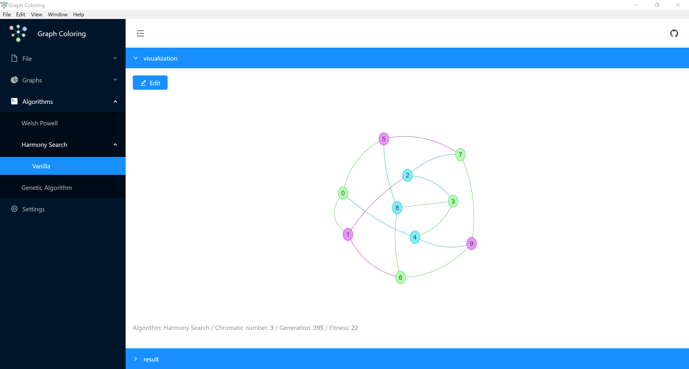

# Graph Coloring

[](LICENSE.md)


# 🚀 Getting Started
A `cross-platform` application to `build graphs` and run `graph coloring` algorithms on them , you can download this app from :
- Windows : [Graph Coloring windows x64][windows]
- Linux : Soon
- Mac : Soon

# 🍄 Introduction

## Graph coloring
Graph coloring is one of the most important concepts in graph theory and is used in many real time applications in computer science. It can be defined as a problem of how to assign colors to certain elements of a graph given some constraints. It is especially used in research areas of science such as data mining, image segmentation, clustering, image capturing, networking etc. Vertex coloring is the most common application of graph coloring. In vertex coloring, given m colors, the aim is to find the coloring of vertices of the graph such that no two adjacent vertices have the same color (Here, adjacent means that two vertices are directly connected by an edge). If this goal is achieved, the graph is said to have proper coloring.

## Algorithms

### Welsh Powell
The algorithm used is a greedy coloring, so it is guaranteed to find *a* coloring which may or may not be optimal. The specific algorithm is the Welsh-Powell algorithm. [Read more about it on Wikipedia.](https://en.wikipedia.org/wiki/Graph_coloring#Greedy_coloring)

### Harmony Search
The standard HS mimics music improvisation process to solve optimization problems. However, it is not suitable for binary representations. This is due to the pitch adjusting operator not being able to perform the local search in the binary space

### Genetic Algorithm
A genetic algorithm is a search heuristic that is inspired by Charles Darwin’s theory of natural evolution. This algorithm reflects the process of natural selection where the fittest individuals are selected for reproduction in order to produce offspring of the next generation.

# ✨ Features

## Supported Algorithms:
- `Welsh Powell`
- `Hamrony Search`
- `Genetic Algorithm`
## Builtin Graphs
- Petersen Graph
- Konigsberg Bridges Graph
- Configurable Complete Graph
- Configurable Hypergraph
- Custom Graphs

## Editing
- Graphically Add/Edit/Delete Vertices and Edges

## Import Graph
- you can import json graph (`gephi`) or `dimacs` graphs (.col, .dimacs)

## Export Graph
- you can export your graph as .json and .dimacs 

# 👦 Implementation
I used angular and electron for developing my application for cross-platform application 

Currently runs with:

- `Angular` v6.1.2
- `Electron` v2.0.3
- `Electron Builder` v20.13.4
- `Vis.js`
- `Typescript` v2.7.2

# 👽 Develop
If you want to build this app locally or develop this repo

``` bash
npm install
```

## To build for development

``` bash
 npm start
```  

You can desactivate "Developer Tools" by uncommenting `win.webContents.openDevTools();` in `main.ts`.

## Included Commands

You can find commands for build in browser or windows , linux , mac in `package.json`

# ☑ TODO

## Algorithms
- Tabu Search
- Simulated Annealing

## Algorithm Improvement
- Implement Other Fitness Function
- Implement Other Harmony Search

## Application
- Add graph state for redo/undo
- Compare algorithms
- Chart for each algorithms

# 👬 Contribution

Help me in this application with your feedback and your discussion

- Open pull request with improvements
- Discuss feedbacks and bugs in issues 
- Reach out with any feedback [My Twitter](https://twitter.com/amirdeljouyi)

**Please title your issue with [Bug] or [Feature Request] depending on if your issue is a bug or a feature request.**

[license-badge]: https://img.shields.io/badge/license-Apache2-blue.svg?style=flat
[license]: ./LICENSE.md
[windows]: https://github.com/amirdeljouyi/graph-coloring/releases/download/v1.0.1/graph-coloring-windows.exe